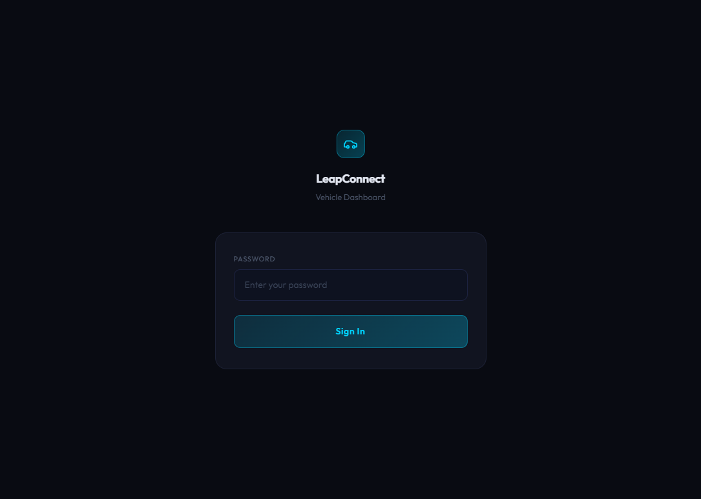
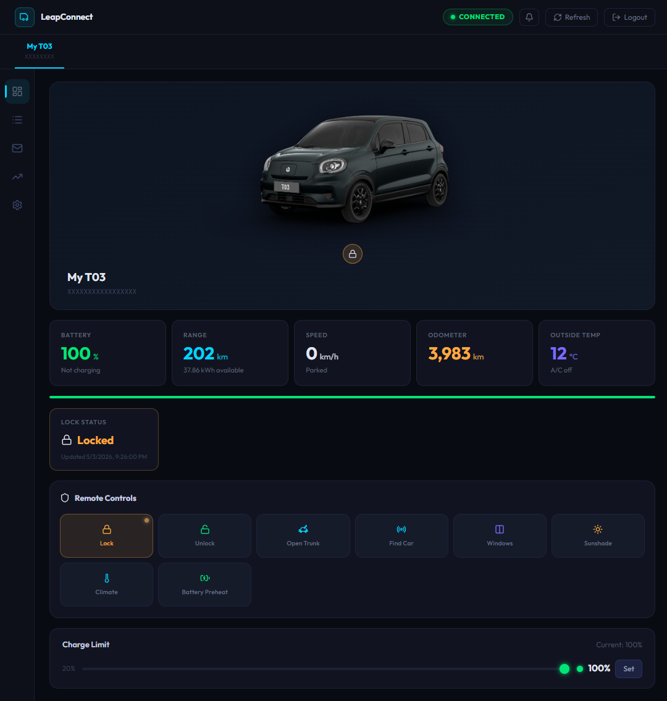
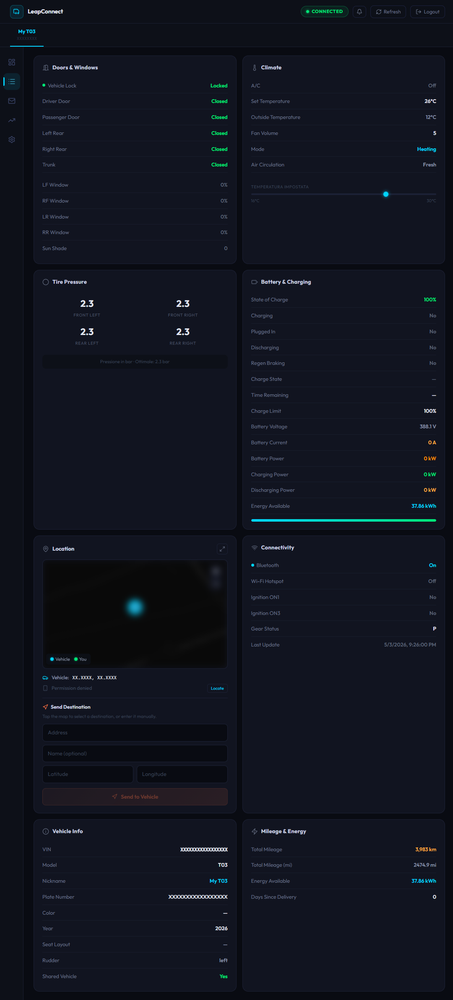
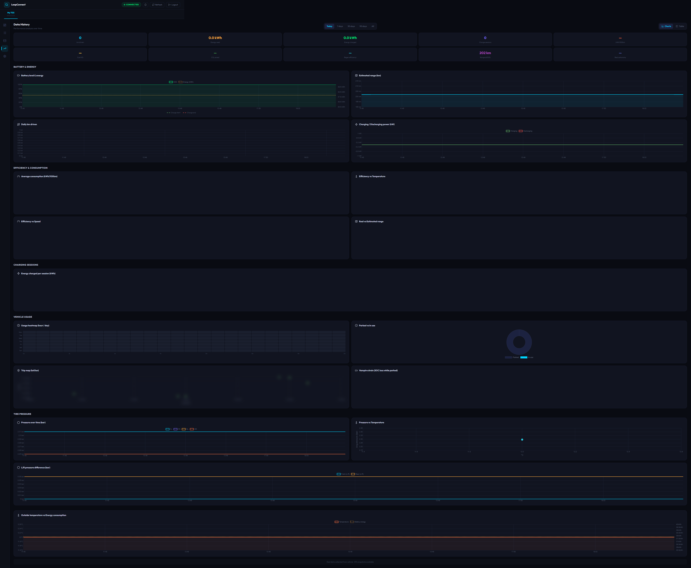
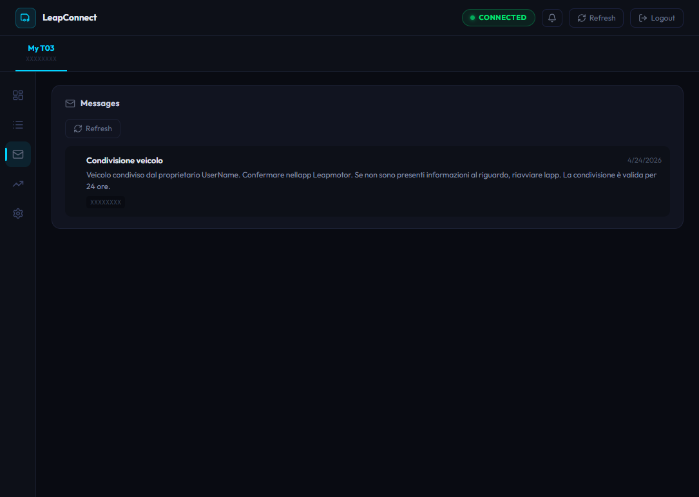
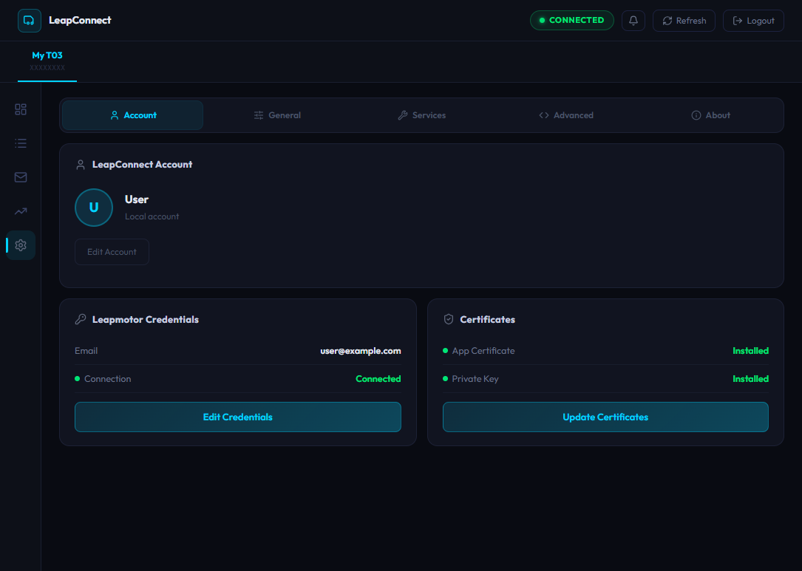

# LeapConnect

[](https://github.com/markoceri/leapconnect/actions/workflows/ci.yml)
[](https://ghcr.io/markoceri/leapconnect)
[](https://github.com/markoceri/leapconnect/blob/main/LICENSE)
[](https://github.com/markoceri/leapconnect/releases)
[](https://www.python.org/)
[](https://fastapi.tiangolo.com/)
[](https://vuejs.org/)
[](https://github.com/astral-sh/ruff)
[](https://github.com/markoceri/leapconnect/stargazers)
[](https://github.com/markoceri/leapconnect/issues)
[](https://ko-fi.com/markoceri)

Web dashboard for monitoring and controlling Leapmotor vehicles via the [leapmotor-api](https://github.com/markoceri/leapmotor-api) Python client.

## Features

- **Live vehicle status**: Battery, range, speed, odometer, temperature, lock status and more — with configurable auto-refresh via WebSocket
- **51 remote commands**: Lock/unlock, trunk, windows, sunroof, sunshade, climate (A/C, quick cool/heat, defrost), battery preheat, start/stop charging, charge schedule, climate schedule, seat heating & ventilation, steering wheel heat, sentry mode, speed limit, send destination, media playback, firmware OTA, find car, and more
- **Charge management**: Adjustable charge limit slider, charge schedule programming (days, times, SOC target), healthy charging toggle, start/stop charging, unlock charger
- **Climate scheduling**: Create, edit, and delete scheduled climate pre-conditioning timers
- **Vehicle details**: Battery & charging info, doors, windows, tire pressure, climate, seat comfort, security, connectivity, charge plan, and vehicle info
- **Location**: OpenStreetMap embedded view with coordinates and send-to-car destination picker
- **History & analytics**: Interactive charts for SOC, range, speed, efficiency, charging sessions, energy consumption, vampire drain, tire pressure, usage heatmap, trip map with GPS traces, and CSV export
- **Cloud statistics**: Weekly energy consumption ranking and distribution from Leapmotor cloud
- **Vehicle messages**: Notifications from Leapmotor with unread count and pagination
- **Car picture**: Dynamic image reflecting lock status, doors, windows, sunshade, and lights
- **Permission gating**: Controls filtered by vehicle hardware abilities and user account permissions
- **Multi-vehicle**: Tab switching for accounts with multiple vehicles
- **Home Assistant integration**: Optional MQTT export of all vehicle data for smart home automation
- **ABRP integration**: Optional live telemetry to [A Better Route Planner](https://abetterrouteplanner.com) for real-time route planning
- **Local history recording**: Optional SQLite database to track and visualize vehicle data over time
- **Dark & light theme**: Switchable UI theme
- **Live log viewer**: Real-time application logs in the browser for troubleshooting
- **Guided setup wizard**: Step-by-step first-run configuration for certificates, account, and services

## Screenshots

| Login | Dashboard | Details |
|:---:|:---:|:---:|
| [](docs/screenshots/login.png) | [](docs/screenshots/dashboard.png) | [](docs/screenshots/details.png) |

| History | Messages | Settings |
|:---:|:---:|:---:|
| [](docs/screenshots/history.png) | [](docs/screenshots/messages.png) | [](docs/screenshots/settings.png) |

## Tested Vehicles

| Model | Status |
|-------|--------|
| T03 | ✅ Tested |
| C10 | 🟡 Should work (same cloud API) |
| B10 | 🟡 Should work (same cloud API) |
| B05 | 🟡 Should work (same cloud API) |

## Requirements

- Docker & Docker Compose (for production)
- [uv](https://docs.astral.sh/uv/) (for local development)
- Leapmotor app certificate files (`.pem`) — [download here](https://github.com/markoceri/leapmotor-certs/archive/refs/tags/v1.0.0.zip)
- A valid Leapmotor account

> **⚠️ Strongly recommended:** Create a separate Leapmotor account and share your vehicle with it, rather than using your primary account. This way, if anything goes wrong (e.g. account suspension), your main account remains unaffected.

## Quick Start (Docker)

### Using the pre-built image

```bash
docker pull ghcr.io/markoceri/leapconnect:latest
```

Create a `docker-compose.yml`:

```yaml
services:
  generate-certs:
    image: alpine:latest
    entrypoint: /bin/sh
    command:
      - -c
      - |
        if [ -f /certs/traefik.crt ] && [ -f /certs/traefik.key ]; then
          echo "Certificates already exist, skipping."
          exit 0
        fi
        apk add --no-cache openssl
        SAN="DNS:localhost,IP:127.0.0.1"
        for ip in $$(hostname -I 2>/dev/null); do SAN="$$SAN,IP:$$ip"; done
        openssl req -x509 -nodes -days 3650 \
          -newkey rsa:2048 \
          -keyout /certs/traefik.key \
          -out /certs/traefik.crt \
          -subj "/CN=leapmotor-webapp" \
          -addext "subjectAltName=$$SAN"
    volumes:
      - ./traefik/certs:/certs
    network_mode: host

  traefik:
    image: traefik:latest
    depends_on:
      generate-certs:
        condition: service_completed_successfully
    command:
      - "--providers.docker=true"
      - "--providers.docker.exposedbydefault=false"
      - "--entrypoints.web.address=:80"
      - "--entrypoints.websecure.address=:443"
      - "--entrypoints.web.http.redirections.entrypoint.to=websecure"
      - "--entrypoints.web.http.redirections.entrypoint.scheme=https"
      - "--providers.file.filename=/etc/traefik/dynamic.yml"
    ports:
      - "80:80"
      - "443:443"
    volumes:
      - /var/run/docker.sock:/var/run/docker.sock:ro
      - ./traefik/dynamic.yml:/etc/traefik/dynamic.yml:ro
      - ./traefik/certs:/certs:ro
    restart: unless-stopped

  app:
    image: ghcr.io/markoceri/leapconnect:latest
    environment:
      - HISTORY_DB_PATH=/app/data/history.db
      - DATA_DIR=/app/data
    volumes:
      - ./data:/app/data
    labels:
      - "traefik.enable=true"
      - "traefik.http.routers.leapmotor.rule=PathPrefix(`/`)"
      - "traefik.http.routers.leapmotor.entrypoints=websecure"
      - "traefik.http.routers.leapmotor.tls=true"
      - "traefik.http.services.leapmotor.loadbalancer.server.port=8099"
    restart: unless-stopped
```

```bash
docker compose up -d
```

The app will be available at **https://localhost**.

### Building from source

```bash
git clone https://github.com/markoceri/leapconnect
cd leapconnect
docker compose up -d --build
```

The app is available at **https://localhost**.

Traefik handles reverse proxying with HTTPS on port 443 and automatic HTTP→HTTPS redirect on port 80. The app container runs internally on port 8099.

Vehicle history data is persisted in a Docker volume (`app-data`).

### HTTPS & Certificates

The Docker Compose setup includes automatic TLS certificate generation. On first `docker compose up`, a one-shot init container generates a self-signed certificate with all local IP addresses in the SAN (Subject Alternative Name), so you can access the app via `https://<server-ip>` without certificate errors.

- Certificates are stored in `traefik/certs/` (git-ignored)
- If certificates already exist, the init container skips generation
- To regenerate (e.g. after an IP change), delete the old certificates and restart:

```bash
rm traefik/certs/traefik.crt traefik/certs/traefik.key
docker compose up -d
```

Alternatively, you can use the standalone script to regenerate certificates with custom IPs or hostnames:

```bash
rm traefik/certs/traefik.crt traefik/certs/traefik.key
./generate-traefik-certs.sh                     # auto-detect local IPs
./generate-traefik-certs.sh 192.168.1.100       # add extra IP
./generate-traefik-certs.sh myhost.local        # add extra hostname
```

## Contributing

Interested in contributing? Read the [contributing guide](CONTRIBUTING.md) for development setup, testing, and PR guidelines.

## Environment Variables

| Variable | Required | Description |
|----------|----------|-------------|
| `APP_CERT_PATH` | Yes | Path to the app certificate PEM file |
| `APP_KEY_PATH` | Yes | Path to the app key PEM file |
| `ACCOUNT_P12_PASSWORD` | No | P12 password (usually auto-derived from login) |
| `HISTORY_DB_PATH` | No | SQLite database path (default: `/app/data/history.db`) |

## Login

You will need:
- **Email & Password**: Your Leapmotor account credentials
- **Vehicle PIN** (optional): Required for remote control actions (lock, unlock, climate, etc.)

## Disclaimer

**This is NOT an official Leapmotor product.**

LeapConnect is an independent, community-driven project with no affiliation to Leapmotor International or its subsidiaries. It interacts with Leapmotor's cloud services through unofficial, reverse-engineered APIs.

By using this software you acknowledge that:

- You use LeapConnect **entirely at your own risk**.
- The author(s) accept **no responsibility** for any consequences, including but not limited to account suspension or ban by Leapmotor.
- Vehicle commands are sent over unofficial channels — **use remote controls with caution**.
- The project may stop working at any time if Leapmotor changes its APIs.
